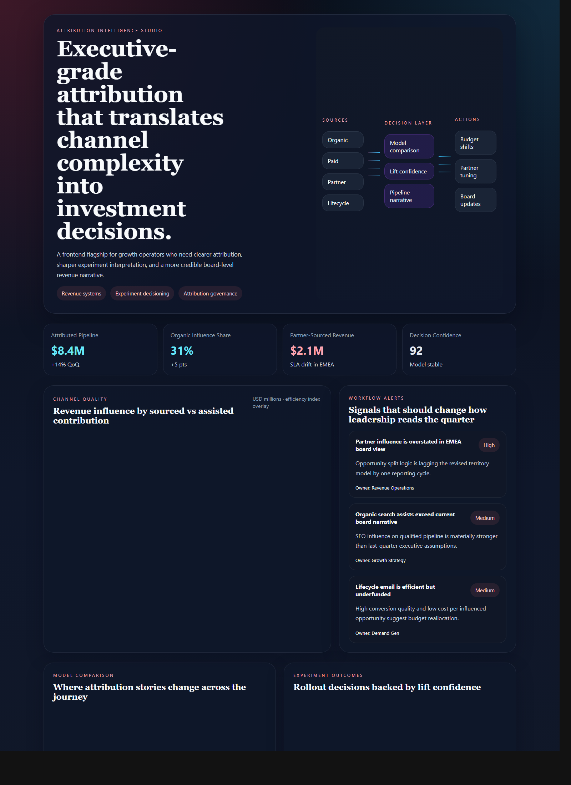
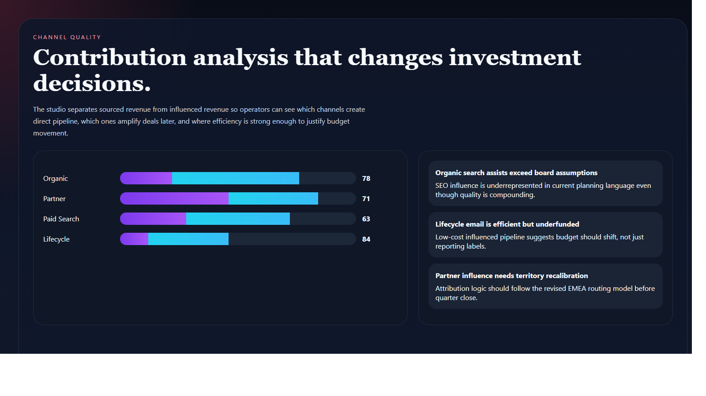
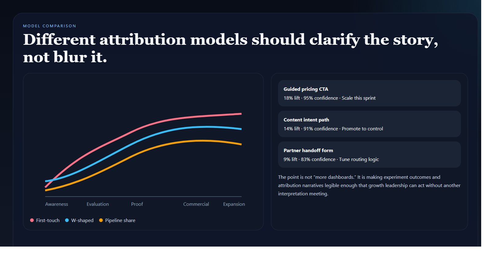
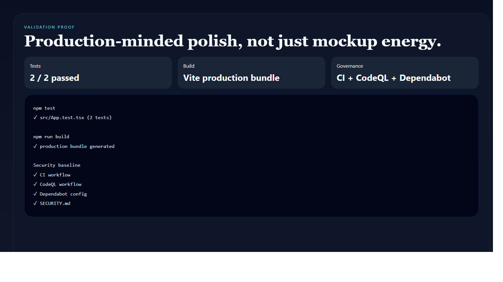

# Attribution Intelligence Studio

> **React + TypeScript portfolio project** demonstrating multi-touch attribution analysis, growth decisioning, experiment interpretation, and executive-facing frontend systems design.

**Recruiter takeaway:** *"This person can turn messy growth analytics into a decision surface leadership can actually use."*

---

## Project Overview

| Attribute | Detail |
|---|---|
| **Frontend Stack** | React 19 + Vite + TypeScript |
| **Domain** | Attribution modeling, experiment interpretation, growth operations |
| **Audience** | Growth leadership, RevOps, demand gen, executive stakeholders |
| **Signal Areas** | Sourced pipeline · influenced revenue · experiment lift · channel efficiency |
| **Portfolio Role** | Frontend flagship for revenue and analytics workflow design |
| **Validation** | Vitest + Testing Library |

---

## Executive Summary

Attribution Intelligence Studio is a recruiter-ready frontend project built to feel like a premium internal growth operating system. Instead of showing generic charts, it frames attribution as an executive decision layer: which channels actually create pipeline, which models shift the narrative, and which experiment outcomes deserve rollout.

It is designed to show that growth analytics can be productized with the same seriousness as platform tooling.

---

## Business Problem

Attribution reporting often lives in fragmented slide decks, ad-platform exports, and disputed spreadsheets. Teams struggle to reconcile sourced pipeline, assisted influence, and experiment lift into one clear operating view. Leadership needs a system that explains what is working, where confidence is high, and what action should happen next.

---

## Solution

This studio turns attribution into a coordinated frontend surface for:

- channel contribution and efficiency analysis
- model comparison across the journey
- experiment lift and rollout guidance
- workflow alerts that change planning
- premium executive-ready visualization

---

## Architecture

```text
Attribution datasets and experiment signals
    |
    v
Static TypeScript data model
    |
    v
React application shell
    |
    +--> executive signal cards
    +--> contribution charts
    +--> model comparison views
    +--> experiment decisioning panels
    +--> narrative workflow alerts
```

### Workspace Flow

1. Leadership lands on a single executive signal layer.
2. Contribution charts reveal which channels source and influence revenue.
3. Model comparison exposes where first-touch and multi-touch narratives diverge.
4. Experiment outcome panels convert lift into rollout decisions.
5. Workflow alerts highlight where attribution interpretation should change planning.

---

## Screenshots

### Hero Capture



### Contribution and Workflow View



### Model and Lift Comparison



### Validation Proof



---

## Key Design Decisions

| Decision | Rationale |
|---|---|
| **Editorial-executive framing** | Makes the project feel like a board-ready growth workspace, not a chart sandbox |
| **Narrative workflow alerts** | Keeps the interface tied to action instead of passive dashboard viewing |
| **Multiple attribution views** | Shows model tension clearly instead of hiding it behind one arbitrary KPI |
| **Warm analytical palette** | Gives this repo a distinct visual identity within the broader portfolio |
| **Purposeful charting** | Uses charts to support decisions, not to inflate complexity |

---

## What An Engineering Leader Sees Here

- frontend systems design grounded in growth and analytics operations
- ability to translate messy business logic into a credible product surface
- charting choices that support decision quality rather than noise
- portfolio breadth across revenue, operations, governance, and executive tooling

---

## Getting Started

### Prerequisites

- Node.js 20+
- npm

### Setup

```bash
git clone https://github.com/mizcausevic-dev/attribution-intelligence-studio.git
cd attribution-intelligence-studio
npm install
cp .env.example .env
npm run dev
```

Open:

- `http://localhost:5173`

### Run Tests

```bash
npm test
```

### Build

```bash
npm run build
```

---

## What This Demonstrates

- premium frontend execution for revenue and analytics workflows
- attribution and experiment decisioning translated into product structure
- strong charting and information hierarchy choices
- React + TypeScript implementation with tests and production-minded repo hygiene
- portfolio breadth beyond backend systems alone

---

## Future Enhancements

- scenario filters for segment, region, and funnel stage
- attribution model version switching
- export views for board and planning narratives
- benchmark overlays for efficiency and spend quality
- API-backed experiment history and confidence tracking

---

## Tech Stack

[](https://react.dev/)
[](https://vite.dev/)
[](https://www.typescriptlang.org/)
[](https://recharts.org/)
[](https://vitest.dev/)
[](https://opensource.org/license/mit)

### Portfolio Links

- [LinkedIn](https://www.linkedin.com/in/mirzacausevic)
- [Skills Page](https://mizcausevic.com/skills/)
- [Medium](https://medium.com/@mizcausevic)
- [GitHub](https://github.com/mizcausevic-dev)

---

*Part of [mizcausevic-dev's GitHub portfolio](https://github.com/mizcausevic-dev) — demonstrating growth-systems thinking, analytics product design, and executive-grade attribution storytelling.*
